# The Orchard content lifecycle, discovery through decommission

**Date:** 2026-08-03
**Related:** ADR-0017 (the separation), ADR-0018 (the model map), ADR-0019 (the
content database)

One content item, from the moment a discovery pass first notices the topic to
the moment it is retired. Every state below is a state a real record is in, in a
real system, and every arrow is something that actually happens to it.

Three systems carry the item, and they answer different questions. Confusing
them is the main way a process like this rots:

| System | Answers | Authoritative for |
|---|---|---|
| Discovery list | what could we build, and why do we think so | candidate evidence and triage |
| Content database | what do we have, and what state is it in | content state, forever |
| Work tracker | who did what work, and when was it done | the work, not the content |

The database is the source of truth for **content**. The work tracker is the
source of truth for **work**. A content item outlives any number of work items
about it.

## The whole cycle

```mermaid
flowchart TD
    subgraph PHASE1["Phase 1, discovery (built)"]
        A1["Operator runs discovery"] --> A2["Survey the watch list<br/>22 of 27 sources reachable"]
        A2 --> A3["Measure our corpus per surface<br/>Learn / Field Guide / visual guide"]
        A3 --> A4{"Demand present<br/>AND supply at zero?"}
        A4 -->|no| A5["Not a candidate<br/>nothing recorded"]
        A4 -->|yes| A6["Proposal emitted"]
        A6 --> A7["Merge into discovery list"]
        A7 --> A8["Candidate<br/>carries evidence + provenance"]
    end

    A8 --> B1["Score the candidate"]

    subgraph PHASE2["Phase 2, selection and the content database (built)"]
        B1 --> B2{"Owner decision"}
        B2 -->|reject| B3["Rejected<br/>never re-proposed"]
        B2 -->|defer| B4["Stays a candidate<br/>re-measured next run"]
        B2 -->|select| B5["Promote"]
        B5 --> B6["work_item created<br/>kind: needs-creating"]
        B5 --> B7["Story created in the tracker<br/>linked to the work_item id"]
    end

    B6 --> C1["generate-briefs.mjs pulls from the queue<br/>brief id carries the subject id<br/>work_item state: claimed"]

    subgraph PHASE3["Phase 3, creation and publication"]
        C1 --> C2["Draft, verify, adversary, arbiter"]
        C2 --> C2a["Proposal written<br/>named after the brief"]
        C2a --> C2b["ingest-proposals.mjs<br/>reads the run record"]
        C2b --> C3{"Ensemble agrees?"}
        C3 -->|no| C4["work_item state: blocked<br/>findings recorded"]
        C4 --> C2
        C3 -->|yes| C5["work_item state: in-progress<br/>proposal inert, pending decision"]
        C5 --> C6{"Human approves?"}
        C6 -->|no| C4
        C6 -->|yes| C7["Content committed and published"]
        C7 --> C7a["record-publication.mjs<br/>run, brief, proposal, accepter"]
        C7a --> C8["work_item state: done<br/>item appears in the index"]
        C7a --> C9["Story closed"]
    end

    C8 --> D1{"Instructor-led<br/>rendering wanted?"}

    subgraph PHASE4["Phase 4, virtual instructor"]
        D1 -->|no| D2["Written content only"]
        D1 -->|yes| D3["Author script and scenes"]
        D3 --> D4["Render narration, captions,<br/>transcript, avatar video"]
        D4 --> D5["Build immutable package<br/>+ integrity manifest"]
        D5 --> D6["rendering row written<br/>avatar and voice recorded"]
        D6 --> D7["Player serves the package<br/>NO inference at learn time"]
    end

    C8 --> E1["Currency engine watches<br/>cited sources"]
    D6 --> E1

    subgraph PHASE5["Phase 5, currency and retirement"]
        E1 --> E2{"A cited source changed?"}
        E2 -->|no| E3["No action<br/>no model call made"]
        E2 -->|yes| E4["v_affected_by_source<br/>names every item at risk"]
        E4 --> E5{"Any claim affected?"}
        E5 -->|no| E6["No-change finding recorded"]
        E5 -->|yes| E7["work_item created<br/>kind: needs-updating"]
        E7 --> E8["NEW story, Related to the original"]
        E8 --> C1
        E7 --> E9{"Still worth keeping?"}
        E9 -->|no| E10["Deprecated<br/>reason recorded"]
        E10 --> E11["Unpublished, redirect set,<br/>record retained"]
    end
```



## The authoring ensemble: six roles are required, four exist

Every piece of content, whether written for the first time or corrected after a
source changed, must pass through the same ordered ensemble. **The same ensemble
applies to the scheduled currency scans.** It is one platform with two triggers,
so a role added here is a role the weekly run gets too, and an update needs
research more than a first draft does: the whole trigger is that a cited source
changed, and nothing can assess that without reading what changed.

Each role runs as a separate call, with its own prompt, against a **different
vendor family** wherever the roles check each other. Two models from one family
agree for reasons that have nothing to do with whether the content is right.

| # | Role | Owns | State |
|---|---|---|---|
| 1 | **Researcher** | Gathers primary sources before anything is written, and hands the drafter evidence rather than a topic. | **NOT BUILT** |
| 2 | **Drafter** | Writes the content from the brief and the researcher's evidence. | Built |
| 3 | **Verifier** | Checks every claim against the supplied evidence. Different vendor family from the drafter, enforced. | Built |
| 4 | **Adversary** | Attacks the draft rather than reviewing it. Looks for what is overstated, unsupported, or invented. | Built |
| 5 | **Arbiter** | Breaks a tie when the verifier and adversary disagree. Never judges its own output. | Built |
| 6 | **Finalizer** | Structure, formatting, citations rendered at the end, knowledge checks correct and answerable from the material, and the item placed correctly in its learning path. | **NOT BUILT** |

### Why the two missing roles are the two that matter

The ensemble is strongest exactly where it is easiest to over-build, three
independent checkers, and absent at both ends.

**Without a researcher**, the drafter can only restate its brief. A brief
instruction such as "do not invent tool names, version numbers, or configuration
keys" becomes a hope rather than a control, because there is no supplied evidence
to check an invention against. The verifier is then checking prose against prose.

**Without a finalizer**, nothing owns the things a reader actually judges the
content by: whether the sources are listed, whether the exam questions can be
answered from the material, and whether the module sits in the right place in a
path. Those are not writing problems and a drafter will not catch them.

### The constraint a researcher must respect

Fetched source text is **untrusted data, never instruction**. The platform
already fences it inside a per-run nonce so retrieved text cannot forge a closing
delimiter and resume instruction context, and a run aborts rather than stripping
a forged delimiter. A researcher role uses that existing machinery. It does not
get a new, looser path to the model.

### Proven, 2026-08-04

The four built roles ran end to end against the live estate: **9 requests,
$0.57, four vendor families**, drafter `gpt-5-6-sol`, verifier
`grok-4-20-reasoning`, adversary `deepseek-v4-pro`, arbiter `mistral-large-3`.

**Both proposals came back `blocked`.** The pipeline works and the content was
not good enough, which is the correct outcome for a gate and the reason nothing
was published. Missing roles 1 and 6 is the leading explanation.

One defect fixed to get there: the drafter returned an **empty completion**
because reasoning tokens are billed against `max_completion_tokens`, and a 4096
budget was consumed entirely by reasoning before a single word of prose. The
budget is raised per role in the brief, never globally, because the global value
feeds the pre-flight cost projection and raising it aborts the run on the spend
ceiling before request one.

## Is the lifecycle actually a cycle? Yes, as of 2026-08-04. All three breaks closed.

Each phase worked long before the whole did, because the phases were the boxes
and the breaks were in the arrows. Three arrows were missing.

| Break | What happened | Closed by |
|---|---|---|
| **Phase 2 to Phase 3** | The queue held 24 items needing creation. The ensemble read **hand-written briefs**. The two lists had no relationship, so nothing in the queue could ever be picked up and work was chosen by whoever last edited the brief file. | `scripts/generate-briefs.mjs` |
| **Phase 3 to Phase 2** | The ensemble wrote a proposal to a directory. Nothing read it back, so an item stayed `queued` forever and a human reconciled two lists by hand. | `scripts/ingest-proposals.mjs` |
| **Phase 3 to Phase 5** | Nothing recorded what was published or from which proposal, so provenance from a published item back to the run that produced it did not exist. | the `publication` table and `scripts/record-publication.mjs` |

### The rule that closes the outbound arrow

**A brief must carry the subject id of the queue item it serves.**

The delivery platform names its proposal file after the brief that produced it,
and the ingest recovers the queue item from that filename. That filename is the
entire channel from the ensemble back to the queue. So the generator encodes the
subject id in the brief id, as `p42-create-<subject>` or `p42-update-<subject>`,
and **refuses to emit a brief whose id would not survive the trip**: the platform
lowercases and rewrites anything outside `a-z0-9._-` on its way to a filename,
and an id that changes on the way through is an id that cannot be recovered.

Before this, run against the two real proposals from the first successful
ensemble run, the ingest reported `0 work item(s) would move` and `2 proposal(s)
NOT MATCHED`. It still reports unmatched rather than guessing, because a wrong
match writes a real state change onto the wrong content. It just no longer has
anything to report against a generated brief.

### The return arrow, and what it will not do

- **It never publishes.** A proposal is inert until a human accepts it. The
  ingest records that a proposal exists and what the reviewers concluded.
- **It never overrides a human.** An item a person moved to `rejected` or `done`
  stays there. Automation may propose a state change and may not perform one.

### The provenance arrow

`record-publication.mjs` is the human's instrument, and its shape says so:
`--accepted-by` is required and has no default, because a publication with
nobody named on it is an automated publication and this pipeline does not do
those. It is also the only tool that writes the terminal `done` state.

`v_provenance` answers "which run wrote this, under which brief, and what did its
reviewers conclude". Filtering the table on `run_id` answers the other direction,
which is the query to run the day a model is found to be producing bad content.
**`v_unprovenanced` is its honest companion**: content that predates the pipeline
or was committed by hand has no row at all, and without it a mostly untraced
estate would read as fully traced. Same reason `v_unmeasurable` exists.

### Proven end to end, and what "proven" means here

`scripts/test-lifecycle.mjs` walks one topic all the way round: discovered,
queued, briefed, blocked by the ensemble's own reviewers, re-drafted, passed,
accepted by a person, indexed by a rebuild, and then aged past its review cadence
until the currency engine queues the same item again as an update. **31
assertions on the arrows rather than the boxes.**

The delivery platform is not run inside that test: it needs a managed identity
and costs real money per run. What is reproduced exactly is the only thing it
hands back, the run record, with the proposal filename built through the real
normalizer. Separately, `Test-Project42DeliveryBriefs.ps1` drives the **generated
backlog itself** through the real entry point with a synthetic transport, and
checks that the proposal filenames the platform actually writes still recover
back to their subject ids.

### Three defects this work found, all on the happy path

1. **The ingest did not know `ready-for-draft`**, which is the only pass
   disposition the platform emits. Every failure path worked, so the run where
   both proposals came back `blocked` looked like proof the tool worked. The
   first proposal to PASS would have been filed as an unknown disposition and
   its queue item left sitting.
2. **The model map staffed the drafter and the verifier from the same vendor
   family**, and the platform throws `INDEPENDENCE` on that at request time,
   after the draft has been paid for. That ensemble could never have completed a
   run. Brief generation now checks the same rule before any money is spent.
3. **One subject can carry two work items at once**, a completed creation and an
   open update, and the ingest keyed on subject id alone. An update proposal
   would have reopened the completed creation, and the terminal-state guard read
   whichever row SQLite returned first.

### Still open, and not a broken handoff

**Ten of the twenty-four queued items are on the `visual-guide` surface, which
has no home directory in the estate.** The generator reports them as stranded and
emits nothing for them, because a proposal that cannot name a repository and path
cannot be reviewed. Giving that surface a `pathTemplate` in
`config/surface-targets.json` is an owner decision about where visual guides
live, not a defect in the cycle.

## Phase 4 is on hold, and the reason is a design question not a technical one

**Held 2026-08-04 by owner decision**, so that the Learn surface can be designed
before anything is rendered against it. Rendering 29 modules against a structure
that is about to change would be waste, and the avatar and voice choices are
already recorded and do not expire.

**The load-bearing rule, which the hold does not change: instructor-led is a
second RENDERING of one module, not a second track and not a replacement for
self-paced.**

The platform is already built this way. Every class-ready module already carries
`class-script.json`, `captions/`, `transcripts/`, `alternatives/` and
`integrity.json` beside the module itself. Everything exists except rendered
audio and video.

Two separate tracks would mean maintaining the same subject twice. They drift,
and when a cited source changes the currency engine cannot reconcile two copies
of the same claim. A `hasInstructorPackage` flag on the row is far cheaper than a
parallel catalogue, and it keeps one source of truth feeding every rendering
derived from it.

So the Learn redesign is a question about **presentation and navigation**, not
about replacing one catalogue with another. A learner should be able to read a
module or watch it, and both should come from the same content.

### Both renderings carry the knowledge check, and progress is identical

**Decided 2026-08-04.** Instructor-led includes the same knowledge check, and a
learner's record is the same whichever way they took the module.

**This needs no change, and the reason is worth knowing.** The learning event
contract already keys every command and event by `pathId` and `moduleId`, and
carries no field for rendering, delivery mode, or format anywhere. Progress is
therefore recorded **against the module, not against how it was consumed**, which
is exactly the required behaviour and was true before anyone asked for it.

Three consequences follow, and all three are desirable:

- A learner can **read half a module and watch the rest**, and the record is one
  record. Nothing forces a choice at the start.
- **A badge or credential means the same thing** however it was earned, which is
  the only defensible position if both renderings teach the same material and
  ask the same questions.
- **Completion cannot be gamed by switching rendering**, because there is nothing
  to switch between as far as the record is concerned.

**If a rendering is ever recorded, it must be an annotation and never a key.**
Knowing which modules were watched is useful for two real purposes: judging
whether the instructor work earns its cost, and building a re-render list if an
avatar is withdrawn. Neither is a reason to let it touch completion, and adding a
field to a portable learning record is a contract change rather than a detail.

## Phase 4 proven, and it corrected the avatar decision

**A real lesson rendered on 2026-08-04.** The opening 87 seconds of *Agents,
Tools, and Guardrails*, spoken from that module's own class script, with captions
embedded. Submit to finished video in about two and a half minutes. It plays on
the Learn page today.

**Cost, measured rather than estimated.** Two separate meters:

| Meter | First render |
|---|---|
| `talkingAvatarDurationSeconds` | 86 |
| `hdNeuralCharacters` | 1281 |

Video is billed by **duration**, the voice by **character**. A full seventeen
segment module extrapolates to roughly twelve to thirteen minutes of video from
about 10,900 characters. **The cost recurs on every re-render**, so a module that
changes often is more expensive to keep as video than as text. That is a real
input to deciding which modules get an instructor package, and it argues for
rendering stable material first.

### The finding that overturned the avatar choice

Three characters had been chosen. **All three are rejected by the batch API.**

```text
camila  -> avatar character camila is not supported
faris   -> avatar character faris is not supported
clara   -> avatar character clara is not supported
lisa    -> WORKS
```

The documented roster and the set batch synthesis accepts **are not the same
list**, and nothing in the documentation says so. The three were selected from
the documentation without ever being submitted to the API that renders.

**It inverts the reason they were preferred.** They were chosen because they sit
outside the actor-licensed set that can be withdrawn when a contract lapses. The
one character proven to work is **inside** that set.

**Leading hypothesis, not confirmed:** the talking heads are **real-time**
avatars and batch supports only `lisa`. If that holds, "which presenter" and
"which synthesis mode" are the same question, and they were treated as
independent.

**The lesson generalises past avatars.** A capability read from documentation is
a claim. A capability exercised against the API is a fact. This is the same shape
as every other defect on this project: something that looked settled, was
believed, and was never measured.
## How a candidate is scored

Scoring exists to make selection arguable rather than instinctive. It does not
decide anything; it orders the queue a human reads.

Implemented in `scripts/score-opportunities.mjs`, with 38 assertions in
`scripts/test-score-opportunities.mjs`. It is read only: it never writes a
registry and never removes an entry.

| Input | Points | Where it comes from | Why it counts |
|---|---|---|---|
| **Breadth of demand** | 35 | how many surveyed sources mention the topic | one source is an anecdote, six is a pattern |
| **Depth of demand** | 15 | total occurrences across those sources | separates a passing mention from a taught subject |
| **Supply gap** | 30 | occurrences in our own corpus, per surface | zero is a gap; a low count may be a thin treatment |
| **Surface spread** | 20 | how many of our surfaces lack it | absent everywhere is worse than absent in one place |
| **Strategic weight** | multiplier | owner set, default 1 | the only subjective input, and it is explicit |

Breadth and depth saturate, at eight sources and twenty occurrences. Past that,
more of the same evidence adds nothing: the difference between eight sources and
eighty is not ten times the confidence.

Breadth reads `provenance.peakSourceCount`, the best reading ever recorded, not
the latest run. A run that reached fewer sources is a fact about the run.

### There is no cutoff score

Nothing is excluded for scoring low, and no threshold decides what reaches the
database. The two honesty rules below are the reason: both understate a real
topic for reasons that have nothing to do with the topic, so a threshold would
turn a temporary measurement into a permanent policy. Ranking is reversible and
exclusion is not.

What the score produces instead is reading order. Attention tiers of `strong`
(3 or more independent sources), `worth a look` (2), and `idea` (1) say where to
start, never what is allowed through.

Two honesty rules on the score, both learned from the first pass:

- **Breadth is capped by reachability.** Five sources refuse automated access,
  so a topic they teach and nobody else does scores zero through no fault of its
  own. The score is a floor, never a ceiling.
- **Demand is measured on a single catalogue page per site.** A site that
  paginates or renders its catalogue with JavaScript exposes almost nothing. A
  low score can mean "rarely taught" or "we could not see it", and today the
  score cannot tell those apart.

### A third honesty rule, learned later

**A topic with no measured demand is not a topic nobody wants.** The surveyed
sources are education providers teaching vendor-neutral curricula, so anything
platform specific scores zero demand no matter how valuable it is. Discovery
will never propose it. Such a topic can still be worth building, but it enters
the plan as **a strategy decision recorded as one**, never as a discovery
finding. Writing it into the registry as though discovery found it corrupts the
one signal the registry exists to carry.

## What the content database carries

Built, and described in ADR-0019. The design in one line: **content files stay
the source of truth, the database is compiled from them, and two tables hold
state that exists nowhere else.**

- **Derived and rebuilt every time:** `item`, `citation`, `source`, `candidate`.
  Losing them costs nothing.
- **Authoritative and never dropped:** `work_item`, what a human decided about a
  piece of work, and `rendering`, what was actually produced.

The test for which half a table belongs in: if a git checkout can reproduce it,
it is derived; if it records a decision or an event, it is authoritative.

`needs-creating` and `needs-updating` are one table separated by kind, which is
what makes a single queue serve both new content and corrections. A build
proposes work and never resets it, and `rejected` is terminal.

## The work-tracker model

**One standing Epic per surface family.** Features group by theme. **One story
per selected content item.**

```text
Epic:    Deliver the Learn catalogue
  Feature: Retrieval and grounding curriculum
    Story: Author "Retrieval-augmented generation" (work_item: create:learn-rag-001)
    Story: Author "Embeddings and vector stores"   (work_item: create:learn-emb-002)
  Feature: Leadership and decision-maker track
    Story: Author "AI for executives"              (work_item: create:learn-exec-003)
```

Rules that keep it usable:

1. **A story is created at promotion, not at discovery.** Candidates are not
   work. Putting every candidate on the board buries the board.
2. **The story carries the work item id.** That is the join between the two
   systems, and without it neither can answer questions about the other.
3. **A story closes when the content publishes.**
4. **An update never reopens a closed story.** It creates a new story linked to
   the original. "When was this written" and "when was it last corrected" are
   different questions and both deserve an answer.
5. **Decommissioning is a story too.** Unpublishing has steps, including
   redirects, catalogue removal, and package withdrawal, and an untracked
   removal is how dead links happen.

## What is built, and what is not

| Phase | State |
|---|---|
| 1, discovery | **Built and run.** 24 candidates across 10 topics, registry v0.1.6. |
| 2, selection, scoring, content DB | **Built.** Scoring runs against all 24. The content database compiles 150 items and 550 citations, and carries the queue. |
| 3, creation and publication | **Partly built.** The ensemble runs and emits proposals; it has produced one verifier PASS and nothing published. |
| 4, virtual instructor | **Not built.** Avatar and voice are chosen and validated; no rendering code. |
| 5, currency and retirement | **Partly built.** Change detection runs and `v_affected_by_source` answers the blast-radius question; impact assessment and retirement do not exist. |

The diagram deliberately shows the whole cycle including the parts that do not
exist, because the shape of the end state is what makes each phase reviewable
before it is written rather than after.
