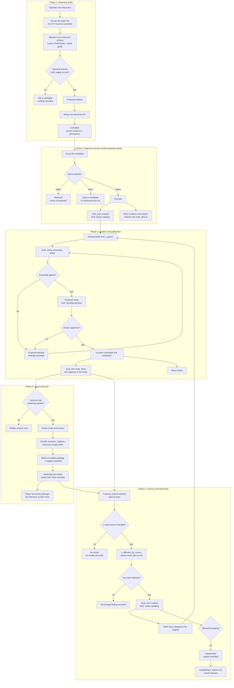

# The Orchard content lifecycle, discovery through decommission

**Date:** 2026-08-03
**Related:** ADR-0017 (the separation), ADR-0018 (the model map), ADR-0019 (the
content database)

One content item, from the moment a discovery pass first notices the topic to
the moment it is retired. Every state below is a state a real record is in, in a
real system, and every arrow is something that actually happens to it.

Three systems carry the item, and they answer different questions. Confusing
them is the main way a process like this rots:

| System | Answers | Authoritative for |
|---|---|---|
| Discovery list | what could we build, and why do we think so | candidate evidence and triage |
| Content database | what do we have, and what state is it in | content state, forever |
| Work tracker | who did what work, and when was it done | the work, not the content |

The database is the source of truth for **content**. The work tracker is the
source of truth for **work**. A content item outlives any number of work items
about it.

## The whole cycle



## How a candidate is scored

Scoring exists to make selection arguable rather than instinctive. It does not
decide anything; it orders the queue a human reads.

Implemented in `scripts/score-opportunities.mjs`, with 38 assertions in
`scripts/test-score-opportunities.mjs`. It is read only: it never writes a
registry and never removes an entry.

| Input | Points | Where it comes from | Why it counts |
|---|---|---|---|
| **Breadth of demand** | 35 | how many surveyed sources mention the topic | one source is an anecdote, six is a pattern |
| **Depth of demand** | 15 | total occurrences across those sources | separates a passing mention from a taught subject |
| **Supply gap** | 30 | occurrences in our own corpus, per surface | zero is a gap; a low count may be a thin treatment |
| **Surface spread** | 20 | how many of our surfaces lack it | absent everywhere is worse than absent in one place |
| **Strategic weight** | multiplier | owner set, default 1 | the only subjective input, and it is explicit |

Breadth and depth saturate, at eight sources and twenty occurrences. Past that,
more of the same evidence adds nothing: the difference between eight sources and
eighty is not ten times the confidence.

Breadth reads `provenance.peakSourceCount`, the best reading ever recorded, not
the latest run. A run that reached fewer sources is a fact about the run.

### There is no cutoff score

Nothing is excluded for scoring low, and no threshold decides what reaches the
database. The two honesty rules below are the reason: both understate a real
topic for reasons that have nothing to do with the topic, so a threshold would
turn a temporary measurement into a permanent policy. Ranking is reversible and
exclusion is not.

What the score produces instead is reading order. Attention tiers of `strong`
(3 or more independent sources), `worth a look` (2), and `idea` (1) say where to
start, never what is allowed through.

Two honesty rules on the score, both learned from the first pass:

- **Breadth is capped by reachability.** Five sources refuse automated access,
  so a topic they teach and nobody else does scores zero through no fault of its
  own. The score is a floor, never a ceiling.
- **Demand is measured on a single catalogue page per site.** A site that
  paginates or renders its catalogue with JavaScript exposes almost nothing. A
  low score can mean "rarely taught" or "we could not see it", and today the
  score cannot tell those apart.

### A third honesty rule, learned later

**A topic with no measured demand is not a topic nobody wants.** The surveyed
sources are education providers teaching vendor-neutral curricula, so anything
platform specific scores zero demand no matter how valuable it is. Discovery
will never propose it. Such a topic can still be worth building, but it enters
the plan as **a strategy decision recorded as one**, never as a discovery
finding. Writing it into the registry as though discovery found it corrupts the
one signal the registry exists to carry.

## What the content database carries

Built, and described in ADR-0019. The design in one line: **content files stay
the source of truth, the database is compiled from them, and two tables hold
state that exists nowhere else.**

- **Derived and rebuilt every time:** `item`, `citation`, `source`, `candidate`.
  Losing them costs nothing.
- **Authoritative and never dropped:** `work_item`, what a human decided about a
  piece of work, and `rendering`, what was actually produced.

The test for which half a table belongs in: if a git checkout can reproduce it,
it is derived; if it records a decision or an event, it is authoritative.

`needs-creating` and `needs-updating` are one table separated by kind, which is
what makes a single queue serve both new content and corrections. A build
proposes work and never resets it, and `rejected` is terminal.

## The work-tracker model

**One standing Epic per surface family.** Features group by theme. **One story
per selected content item.**

```text
Epic:    Deliver the Learn catalogue
  Feature: Retrieval and grounding curriculum
    Story: Author "Retrieval-augmented generation" (work_item: create:learn-rag-001)
    Story: Author "Embeddings and vector stores"   (work_item: create:learn-emb-002)
  Feature: Leadership and decision-maker track
    Story: Author "AI for executives"              (work_item: create:learn-exec-003)
```

Rules that keep it usable:

1. **A story is created at promotion, not at discovery.** Candidates are not
   work. Putting every candidate on the board buries the board.
2. **The story carries the work item id.** That is the join between the two
   systems, and without it neither can answer questions about the other.
3. **A story closes when the content publishes.**
4. **An update never reopens a closed story.** It creates a new story linked to
   the original. "When was this written" and "when was it last corrected" are
   different questions and both deserve an answer.
5. **Decommissioning is a story too.** Unpublishing has steps, including
   redirects, catalogue removal, and package withdrawal, and an untracked
   removal is how dead links happen.

## What is built, and what is not

| Phase | State |
|---|---|
| 1, discovery | **Built and run.** 24 candidates across 10 topics, registry v0.1.6. |
| 2, selection, scoring, content DB | **Built.** Scoring runs against all 24. The content database compiles 150 items and 550 citations, and carries the queue. |
| 3, creation and publication | **Partly built.** The ensemble runs and emits proposals; it has produced one verifier PASS and nothing published. |
| 4, virtual instructor | **Not built.** Avatar and voice are chosen and validated; no rendering code. |
| 5, currency and retirement | **Partly built.** Change detection runs and `v_affected_by_source` answers the blast-radius question; impact assessment and retirement do not exist. |

The diagram deliberately shows the whole cycle including the parts that do not
exist, because the shape of the end state is what makes each phase reviewable
before it is written rather than after.
